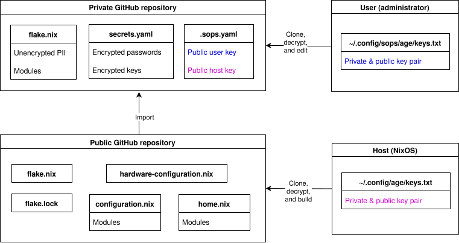

# Nix Configuration

This repository contains my Nix configuration.

## Modularity

I use Nix both (i) as a *package manager* on distributions such as Ubuntu, and (ii) as an *operating system* through NixOS. To maximize configuration reuse, packages are primarily configured through Home Manager rather than system-wide.

## Security and Privacy

Certain parts of my configuration are not made public. These include:
- Passwords and secret keys.
- *Personally identifiable information* (PII), such as email addresses.
- Packages whose usage I prefer not to disclose.

All the above is diverted to a private GitHub repository. Additionally, secret keys and passwords are stored in encrypted form, ensuring that even GitHub cannot read their contents. The encryption is handled using SOPS, largely following the approach described in a [blog post](https://unmovedcentre.com/posts/secrets-management/) from EmergentMind. 

The diagram below illustrates the security architecture. Since SOPS supports multiple private and public key pairs, each host is assigned a unique key pair. A separate dedicated key pair is used to modify the contents of the private repository.

